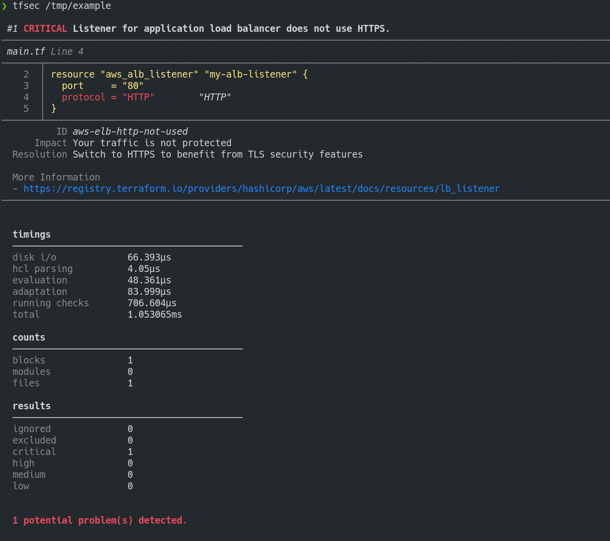
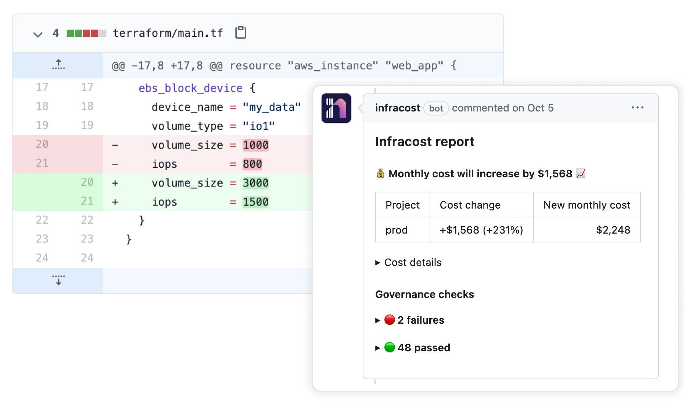
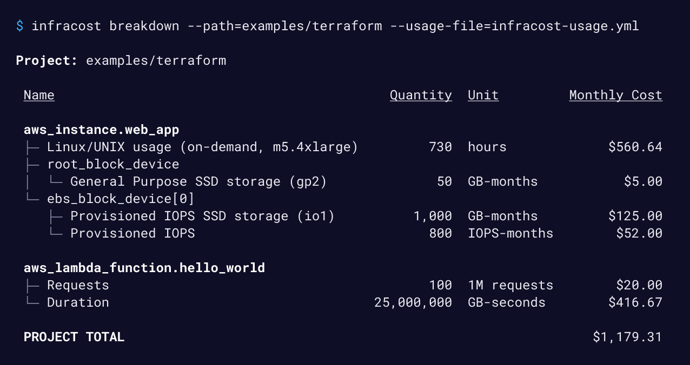
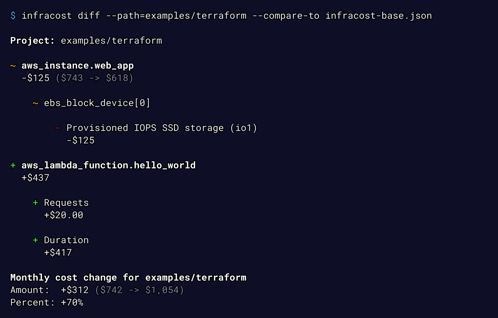
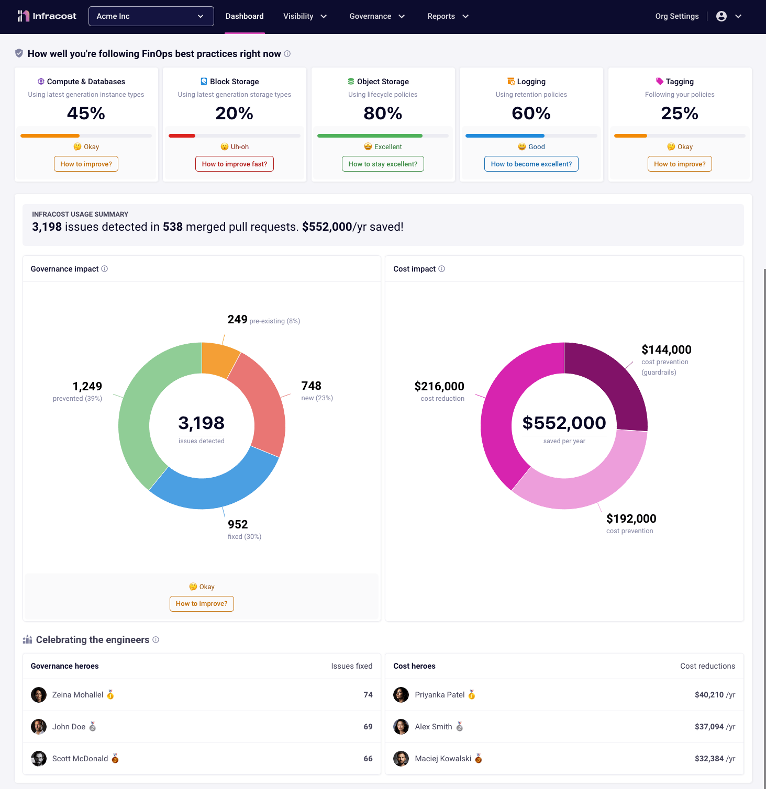

# Tools
Remember, tools are here to help. These will take the headaches out of working with Terraform, making setup, scaling, and deployment easier so you can focus on the important stuff.

# VSCode Extensions
    
* [**Terraform**](vscode:extension/hashicorp.terraform) 

 

### Here are some third party tools that will make you look like a rockstar.

## [**TFLint**](https://github.com/terraform-linters/tflint)
A linter for Terraform code.
* Find possible errors (like invalid instance types) for Major Cloud providers (AWS/Azure/GCP).
* Warn about deprecated syntax, unused declarations.
* Enforce best practices, naming conventions.
* [Install it on Linux](https://github.com/terraform-linters/tflint#installation)
## [**Open Policy Agent**](https://github.com/open-policy-agent/opa) 
OPA gives you a high-level declarative language to author and enforce policies across your stack.

### Why use OPA 
With OPA, you define rules that govern how your system should behave. These rules exist to answer questions like:

* Can user X call operation Y on resource Z?
* What clusters should workload W be deployed to?
* What tags must be set on resource R before it's created?
* You integrate services with OPA so that these kinds of policy decisions do not have to be hardcoded in your service. Services integrate with OPA by executing queries when policy decisions are needed.

* When you query OPA for a policy decision, OPA evaluates the rules and data (which you give it) to produce an answer. The policy decision is sent back as the result of the query.

    * For example, in a simple API authorization use case:

        * You write rules that allow (or deny) access to your service APIs.
        * Your service queries OPA when it receives API requests.
        * OPA returns allow (or deny) decisions to your service.
        * Your service enforces the decisions by accepting or rejecting requests accordingly.

### When to use OPA:

OPA policies are usually run after running `terraform plan` to validate the policy rules.

* Major reasons why you should use OPA:

    * Enforce compliance: Ensures adherence to organizational, industry, or legal standards in Terraform configurations
    * Shift-left security: Identify security vulnerabilities early in development
    * Automate governance: Embed policy checks within CI/CD pipelines to minimize manual governance efforts

## [**Terrascan**](https://github.com/tenable/terrascan)
Terrascan is a static code analyzer for Infrastructure as Code. Terrascan allows you to:

* Seamlessly scan infrastructure as code for misconfigurations.
* Monitor provisioned cloud infrastructure for configuration changes that introduce posture drift, and enables reverting to a secure posture.
* Detect security vulnerabilities and compliance violations.
* Mitigate risks before provisioning cloud native infrastructure.
* Offers flexibility to run locally or integrate with your CI\CD.

**It supports multiple platforms like:**

* **AWS**
* **Azure**
* **GCP**
* **K8s**
* **DigitalOcean** 
* **Civo**
* **And of course, Terraform**

## [**Checkov**](https://github.com/bridgecrewio/checkov)
Checkov reviews your Terraform files (.tf), analyzing the configurations against a set of built-in policies. It detects potential misconfigurations that might lead to security vulnerabilities or fail to meet compliance standards, helping ensure your infrastructure follows best practices and regulations.

### When to use Checkov:

You can run Checkov locally or in CI/CD before running terraform plan to detect potential security issues.

## [**Tfsec**](https://github.com/aquasecurity/tfsec)
A Terraform scanning tool. It is a security-focused linter for Terraform that scans code for security flaws, offering an additional layer of security assurance and helping to maintain a strong security posture.

### When to use Tfsec:

Tfsec can either be run locally or in automated CI/CD environments before terraform plan.

## [**Terragrunt**](https://terragrunt.gruntwork.io/)
Terragrunt offers additional tools to :  
* Your terraform configurations less redundant (DRY) 
* Manage remote state with ease by streamlining remote state management for multiple modules.
* Manage dependencies smoothly: Coordinate module dependencies for orderly and efficient operations.

**It’s especially helpful for managing large-scale infrastructure setups with Terraform.**

## [**Infracost**](https://github.com/infracost/infracost)
Infracost shows cloud cost estimates and FinOps best practices for Terraform. It lets engineers see a cost breakdown and understand costs before making changes, either in the terminal, VS Code or pull requests.

### Why use Infracost?
* Beyond knowing what you're about to spend?
* Supports ***1,100*** Terraform resources across **AWS**, **Azure**, and **GCP**
* Post cost estimates in pull requests

* Cost Breakdown CLI Support

* Diff support

* Got a boss who likes visuals?

## Terraform-docs
A utility to generate documentation from Terraform modules in various output formats.

## Atlantis